# Vehicle Insurance Cross-Sell Prediction

> An end-to-end MLOps pipeline that predicts whether an existing health insurance customer is likely to purchase vehicle insurance — built with Python, MongoDB, AWS (S3 + ECR + EC2), and deployed via a full CI/CD pipeline with GitHub Actions.

[](https://www.python.org/)
[](https://www.mongodb.com/atlas)
[](https://aws.amazon.com/)
[](https://www.docker.com/)
[](https://github.com/features/actions)

---

## Table of Contents

- [Project Overview](#-project-overview)
- [Tech Stack](#-tech-stack)
- [Project Architecture](#-project-architecture)
- [Directory Structure](#-directory-structure)
- [Pipeline Components](#-pipeline-components)
- [Getting Started](#-getting-started)
  - [Prerequisites](#prerequisites)
  - [1. Environment Setup](#1-environment-setup)
  - [2. MongoDB Setup](#2-mongodb-setup)
  - [3. AWS Setup](#3-aws-setup)
  - [4. Running the Training Pipeline](#4-running-the-training-pipeline)
  - [5. Running the App Locally](#5-running-the-app-locally)
- [CI/CD Deployment](#-cicd-deployment)
- [API Routes](#-api-routes)
- [Environment Variables](#-environment-variables)
- [Contributing](#-contributing)
- [License](#-license)

---

## Project Overview

This project solves a real-world business problem: an insurance company wants to identify which of its existing **health insurance customers** would also be interested in **vehicle insurance**. By predicting this cross-sell opportunity, the company can optimize its outreach strategy and reduce marketing costs.

The solution is a **production-grade MLOps system** that handles:

- Automated data ingestion from MongoDB
- Data validation against a predefined schema
- Feature engineering and transformation
- Model training, evaluation, and versioning
- Model storage and retrieval from AWS S3
- A Flask web application for real-time predictions
- Full containerization with Docker
- Automated CI/CD via GitHub Actions → AWS ECR → EC2

---

## Tech Stack

| Layer               | Technology                          |
| ------------------- | ----------------------------------- |
| Language            | Python 3.10                         |
| Web Framework       | FastApi                             |
| Database            | MongoDB Atlas                       |
| Cloud Storage       | AWS S3                              |
| Container Registry  | AWS ECR                             |
| Compute             | AWS EC2 (Ubuntu 24.04)              |
| Containerization    | Docker                              |
| CI/CD               | GitHub Actions (self-hosted runner) |
| Environment Manager | Conda                               |
| ML Libraries        | scikit-learn, pandas, numpy         |
| EDA                 | Jupyter Notebook                    |

---

## Project Architecture

```
Data Source (MongoDB Atlas)
         │
         ▼
┌─────────────────────────────────────────┐
│            Training Pipeline             │
│                                         │
│  [Data Ingestion] → [Data Validation]   │
│         → [Data Transformation]          │
│         → [Model Trainer]                │
│         → [Model Evaluation]             │
│         → [Model Pusher] ───────────────┼──► AWS S3 (model-registry)
└─────────────────────────────────────────┘
                    │
                    ▼
         ┌─────────────────────┐
         │  Prediction Pipeline │◄── Model pulled from S3
         │  FastApi App (app.py) │
         └─────────────────────┘
                    │
                    ▼
          Browser / API Client
```


The CI/CD flow:

```
Git Push (main)
     │
     ▼
GitHub Actions
     │ Build Docker image
     ▼
AWS ECR (push image)
     │
     ▼
EC2 Self-Hosted Runner
     │ Pull & run container
     ▼
Live App on :5000
```

### Pipeline Diagrams

#### Training Pipeline Flow



#### CI/CD Pipeline Flow



## Directory Structure

```
Vehicle-Insurance-Prediction/
│
├── .github/
│   └── workflows/
│       └── aws.yaml                  # CI/CD pipeline definition
│
├── config/
│   └── schema.yaml                   # Dataset schema for data validation
│
├── notebook/
│   ├── EDA.ipynb                     # Exploratory Data Analysis
│   ├── Feature_Engineering.ipynb     # Feature engineering experiments
│   └── mongoDB_demo.ipynb            # MongoDB data ingestion demo
│
├── src/
│   ├── constants/
│   │   └── __init__.py               # Project-wide constants (bucket name, thresholds, etc.)
│   │
│   ├── configuration/
│   │   ├── mongo_db_connections.py   # MongoDB connection utility
│   │   └── aws_connection.py         # AWS S3 connection utility
│   │
│   ├── data_access/
│   │   └── proj1_data.py             # Fetch MongoDB data → Pandas DataFrame
│   │
│   ├── entity/
│   │   ├── config_entity.py          # Config dataclasses for each pipeline component
│   │   ├── artifact_entity.py        # Artifact dataclasses for each pipeline component
│   │   ├── estimator.py              # Custom model wrapper (preprocessor + model)
│   │   └── s3_estimator.py           # Push/pull model from AWS S3
│   │
│   ├── components/
│   │   ├── data_ingestion.py
│   │   ├── data_validation.py
│   │   ├── data_transformation.py
│   │   ├── model_trainer.py
│   │   ├── model_evaluation.py
│   │   └── model_pusher.py
│   │
│   ├── pipeline/
│   │   ├── training_pipeline.py      # Chains all training components
│   │   └── prediction_pipeline.py    # Loads model from S3, runs inference
│   │
│   ├── aws_storage/                  # Low-level S3 read/write helpers
│   ├── logger/                       # Custom structured logging
│   └── exception/                    # Custom exception with traceback info
│
├── static/css/                       # Frontend styles
├── templates/                        #  HTML templates
├── app.py                            # FastApi app entry point
├── demo.py                           # Local pipeline test runner
├── template.py                       # Project scaffold generator script
├── setup.py                          # Installs src/ as a local package
├── pyproject.toml                    # Build system config
├── requirements.txt                  # Python dependencies
├── Dockerfile                        # Container image definition
├── .dockerignore
└── .gitignore
```

---

## Pipeline Components

### 1. Data Ingestion

Connects to MongoDB Atlas, fetches data in key-value format, converts it to a Pandas DataFrame, and splits it into train/test CSV files. Produces a `DataIngestionArtifact`.

### 2. Data Validation

Validates ingested data against `config/schema.yaml` — checks required columns, data types, and null thresholds. Produces a `DataValidationArtifact` with a validation report.

### 3. Data Transformation

Applies feature engineering and preprocessing (imputation, encoding, scaling). Saves the fitted preprocessor object via the custom `Estimator` class. Produces a `DataTransformationArtifact`.

### 4. Model Trainer

Trains a classification model on transformed data, evaluates on the test split, and saves the trained model. Produces a `ModelTrainerArtifact`.

### 5. Model Evaluation

Compares the new model against the currently deployed model in AWS S3. Only accepts the new model if it improves performance by more than `MODEL_EVALUATION_CHANGED_THRESHOLD_SCORE` (default: `0.02`). Produces a `ModelEvaluationArtifact`.

### 6. Model Pusher

If the new model is accepted, pushes it to the S3 bucket under `model-registry/`. Produces a `ModelPusherArtifact`.

### 7. Prediction Pipeline

On app startup, pulls the latest accepted model from S3 and serves real-time predictions via the Flask interface.

---

## Getting Started

### Prerequisites

- [Miniconda or Anaconda](https://docs.conda.io/en/latest/miniconda.html)
- A [MongoDB Atlas](https://www.mongodb.com/atlas) account (free tier is fine)
- An [AWS account](https://aws.amazon.com/) with permissions for IAM, S3, ECR, and EC2
- Git

---

### 1. Environment Setup

```bash
# Clone the repo
git clone https://github.com/NityaPatel05/Vehicle-Insurance-Prediction.git
cd Vehicle-Insurance-Prediction

# Create and activate the conda environment
conda create -n vehicle python=3.10 -y
conda activate vehicle

# Install all dependencies including local src/ package
pip install -r requirements.txt

# Verify local package is installed
pip list
```

---

### 2. MongoDB Setup

1. Sign up at [MongoDB Atlas](https://www.mongodb.com/atlas) and create a new project.
2. Create a free **M0** cluster (keep all defaults).
3. Under **Database Access**, create a DB user (username + password).
4. Under **Network Access**, add IP address `0.0.0.0/0` to allow connections from anywhere.
5. Go to your cluster → **Connect** → **Drivers** → select `Python` / `3.6 or later` → copy the connection string and replace `<password>` with your actual password.
6. Push your dataset to MongoDB:

```bash
jupyter notebook notebook/mongoDB_demo.ipynb
# Run all cells to load the dataset into MongoDB
```

**Set the connection URL as an environment variable:**

```bash
# Bash (macOS / Linux)
export MONGODB_URL="mongodb+srv://<username>:<password>@<cluster>.mongodb.net/?retryWrites=true&w=majority"

# PowerShell (Windows)
$env:MONGODB_URL = "mongodb+srv://<username>:<password>@<cluster>.mongodb.net/?retryWrites=true&w=majority"
```

> **Windows GUI alternative:** Search for "Edit the system environment variables" → Environment Variables → New → Name: `MONGODB_URL`, Value: your connection string.

---

### 3. AWS Setup

#### Create an IAM User

1. AWS Console → **IAM** → **Users** → **Create user** (name: `firstproj`)
2. Attach policy: **AdministratorAccess**
3. Open the user → **Security Credentials** → **Create access key** → select **CLI** → download the CSV

#### Create an S3 Bucket

1. AWS Console → **S3** → **Create bucket**
2. Region: `us-east-1`, Name: `my-model-mlopsproj`
3. Uncheck **Block all public access** and acknowledge → **Create bucket**

**Set AWS credentials as environment variables:**

```bash
# Bash
export AWS_ACCESS_KEY_ID="your-access-key-id"
export AWS_SECRET_ACCESS_KEY="your-secret-access-key"
export AWS_DEFAULT_REGION="us-east-1"

# PowerShell
$env:AWS_ACCESS_KEY_ID="your-access-key-id"
$env:AWS_SECRET_ACCESS_KEY="your-secret-access-key"
$env:AWS_DEFAULT_REGION="us-east-1"
```

---

### 4. Running the Training Pipeline

Make sure all environment variables are set, then run:

```bash
python demo.py
```

This executes the full pipeline:
`Data Ingestion → Validation → Transformation → Training → Evaluation → Model Push to S3`

Pipeline artifacts are saved in the `artifact/` directory (git-ignored).

---

### 5. Running the App Locally

```bash
python app.py
```

Open your browser at `http://localhost:5000`.

---

## ⚙️ CI/CD Deployment

### 1. Create an ECR Repository

```
AWS Console → ECR → Create repository
  Name:    vehicleproj
  Region:  us-east-1
```

Copy the repository URI — you'll need it as a GitHub secret.

### 2. Launch an EC2 Instance

```
AMI:           Ubuntu Server 24.04 LTS
Instance type: t3 Micro
Storage:       30 GB
Key pair:      proj1key (create new)
Security group: Allow HTTP (80), HTTPS (443)
```

After launching, connect via **EC2 Instance Connect**.

### 3. Install Docker on EC2

```bash
# Update packages
sudo apt-get update -y && sudo apt-get upgrade -y

# Install Docker
curl -fsSL https://get.docker.com -o get-docker.sh
sudo sh get-docker.sh
sudo usermod -aG docker ubuntu
newgrp docker
```

### 4. Open Port 5000 on EC2

```
EC2 Console → Your Instance → Security → Security Groups → Edit Inbound Rules
→ Add Rule: Custom TCP | Port: 5000 | Source: 0.0.0.0/0 → Save
```

### 5. Register EC2 as a Self-Hosted GitHub Runner

```
GitHub Repo → Settings → Actions → Runners → New self-hosted runner
  OS: Linux
```

Run all displayed **Download** commands on EC2, then the **Configure** command. When prompted:

- Runner group → press Enter
- Runner name → type `self-hosted`
- Additional labels → press Enter
- Work folder → press Enter

Start the runner:

```bash
./run.sh
```

Verify it shows as **Idle** in GitHub → Settings → Actions → Runners.

### 6. Add GitHub Secrets

```
GitHub Repo → Settings → Secrets and variables → Actions → New repository secret
```

| Secret                  | Value                   |
| ----------------------- | ----------------------- |
| `AWS_ACCESS_KEY_ID`     | From IAM CSV            |
| `AWS_SECRET_ACCESS_KEY` | From IAM CSV            |
| `AWS_DEFAULT_REGION`    | `us-east-1`             |
| `ECR_REPO`              | Your ECR repository URI |

### 7. Deploy

Push any commit to `main` — the CI/CD pipeline triggers automatically. Access the live app at:

```
http://<your-ec2-public-ip>:5000
```

---

## API Routes

| Route       | Method | Description                                   |
| ----------- | ------ | --------------------------------------------- |
| `/`         | `GET`  | Renders the prediction input form             |
| `/predict`  | `POST` | Accepts customer features, returns prediction |
| `/training` | `GET`  | Triggers the full model retraining pipeline   |

---

## Environment Variables

| Variable                | Description                     | Where Used           |
| ----------------------- | ------------------------------- | -------------------- |
| `MONGODB_URL`           | MongoDB Atlas connection string | Training pipeline    |
| `AWS_ACCESS_KEY_ID`     | AWS IAM access key ID           | Training + Inference |
| `AWS_SECRET_ACCESS_KEY` | AWS IAM secret access key       | Training + Inference |
| `AWS_DEFAULT_REGION`    | AWS region (e.g. `us-east-1`)   | Training + Inference |

> **Never commit these values to source control.** Use environment variables locally and GitHub Secrets in CI/CD.

---

## Contributing

1. Fork the repository
2. Create a feature branch: `git checkout -b feature/your-feature`
3. Commit your changes: `git commit -m 'Add some feature'`
4. Push: `git push origin feature/your-feature`
5. Open a Pull Request

---
